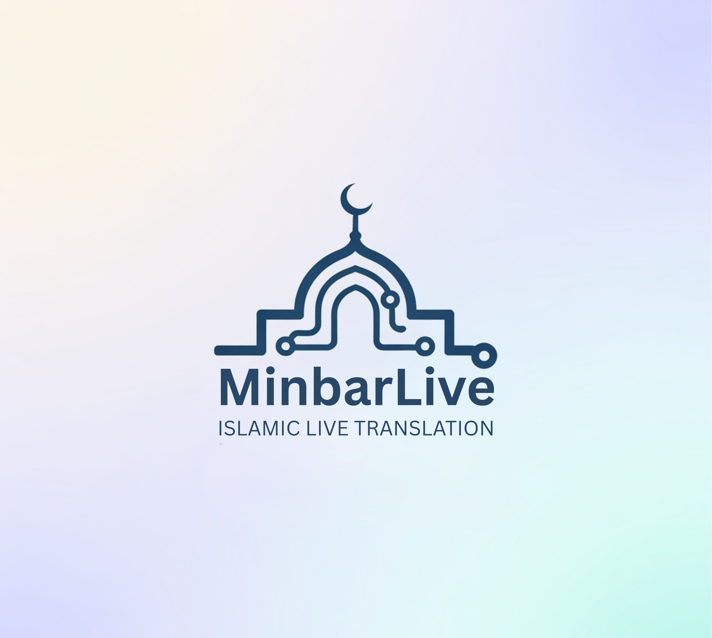

<div align="center">
    <a href="https://github.com/MinbarLive/MinbarLive" />
        
    </a>
</div>

# MinbarLive - Islamic Live Translation

Real-time translation system for mosque lectures and prayers, supporting multiple languages.

## Overview

This application captures live audio — from a microphone or directly from what your PC is playing — transcribes and translates the speech using AI models, and displays the translation as subtitles on a full-screen window (ideal for a second monitor, a projector, or an OBS overlay).

By default it runs in **real-time streaming mode**: the spoken text appears word by word while the speaker talks, and the translation follows each finished utterance after ~1–3 seconds. You can choose your AI provider — **Google Gemini** (default), **OpenAI**, or **Anthropic Claude** — and a first-run setup wizard walks you through language, microphone, provider, and API key.

> **⚠️ Language Note:** The primary development and testing focus was **Arabic → German**. While the app supports 15+ source languages and 35+ target languages, other language combinations have not been extensively tested. The Quran and Athan dictionaries are available in **German, English, Turkish, Albanian, and Bosnian**. Contributions for additional language support are welcome!

### Key Features

- **Real-time streaming transcription** (default): live word-by-word transcript with utterance-based translation — engines: Google Gemini Live, OpenAI Realtime, or Deepgram
- **Segmented mode** as an alternative: chunk-based or semantic sentence buffering
- **Multiple AI providers**: translation via Google Gemini, OpenAI, or Anthropic Claude — switchable in the settings
- **Verified Quran verse output**: RAG matching over precomputed verse embeddings; high-confidence matches display the exact published translation (marked 📖) instead of an AI paraphrase
- Dictionary matching for Athan phrases
- **System audio capture** (Windows): translate whatever is playing on the PC — a stream, a video call, a recording — by picking a `(Loopback)` device instead of a microphone. No virtual audio cable needed
- **Noise filter**: a voice-activity gate drops static, hum and hiss before they reach the AI, so a noisy line can't be turned into invented sentences
- **Bilingual subtitles**: optionally show the original text above the translation
- Three subtitle modes: Realtime feed, continuous ticker, or static display
- **Adjustable subtitle look**: font size, window height, size of the original-text line, and custom colours for translation and original text
- **Announcements**: push a message ("Prayer starts in 5 minutes") onto the subtitle screen for a chosen duration, independently of the translation
- **Input level meter with mic test**: check the signal before you start — a too-quiet mic is the single most common cause of poor recognition
- **Batch mode**: turn a pre-recorded audio/video file into an `.srt` subtitle file (or a plain text transcript)
- **Session history viewer** with AI-generated session summaries and a per-session **cost estimate**
- **Islamic mode toggle**: switch off the Quran/Athan features to use MinbarLive as a general live translator
- First-run setup wizard; control panel in 6 languages (DE, EN, AR, BS, SQ, TR); light & dark theme
- Multi-monitor support with transparent overlay option
- Secure API key storage using the OS keychain
- Automatic silence detection, retries with exponential backoff, model fallback chains
- **Cost guards**: silent segments are never sent to the API, and a forgotten session auto-stops after 10 minutes without speech

📚 **More details:** See the [docs/](docs/) folder for architecture, providers, configuration, and data file documentation.

## ⚠️ API Cost Warning

This application makes continuous API calls while running. **You will be charged for usage by your AI provider.**

Rough guide for an OpenAI setup (segmented mode, Arabic → German); Gemini (the default) is in a similar or lower range:

| Usage Pattern                   | Transcription | Translation | Embeddings | **Total**        |
| ------------------------------- | ------------- | ----------- | ---------- | ---------------- |
| 1 hour session                  | ~$0.36        | ~$0.10      | ~$0.05     | **~$0.50**       |
| Weekly Friday prayer (1 hr × 4) | ~$1.44        | ~$0.40      | ~$0.20     | **~$2.00/month** |

- **Real-time streaming mode** (the default) bills every audio minute **including silence**, and translates per utterance (more, smaller translation calls). Expect a somewhat higher total than segmented mode for the same session.
- Costs differ per provider and model — check [Google Gemini](https://ai.google.dev/pricing), [OpenAI](https://openai.com/pricing), [Anthropic](https://www.anthropic.com/pricing), or [Deepgram](https://deepgram.com/pricing) pricing for current rates, and set a usage limit in your provider account to avoid surprises.
- The app tracks what each of **your** sessions actually used: see the **Costs** tab in the session history (⟲). It is an estimate from published list prices, not a bill.

## Setup

🎬 **Videos:** [What MinbarLive is and how it works](https://www.youtube.com/watch?v=GWvEXOW8930) · [Setup tutorial](https://youtu.be/_VI6Y8qFDZQ)

> 📧 **Need help setting up?** Write us an email at [minbar.live@outlook.com](mailto:minbar.live@outlook.com) and we'll help you with your first setup.

### Prerequisites

- An API key for your AI provider — a **Google Gemini key is the simplest option**: one key covers translation, real-time transcription, and Quran verse matching. (OpenAI/Claude/Deepgram keys are only needed if you choose those providers; Claude has no speech-to-text, so it additionally needs a transcription key.)
- An audio source: a microphone, or — on Windows — any output device captured via loopback (see [Audio Sources](#audio-sources))
- Python 3.10–3.12 (Option B only)

### Option A: Use the EXE (recommended)

1. Download the latest EXE: [Click here](https://github.com/MinbarLive/MinbarLive/releases)
2. Run `MinbarLive.exe`
3. Follow the first-run wizard: interface language & appearance → spoken/subtitle language → microphone → AI provider & API key → disclaimer. Gemini API key tutorial: [EN](https://www.youtube.com/watch?v=Cl4XKgz6EJQ)/[DE](https://youtu.be/alNk5N-pv7Y), or create one directly at [aistudio.google.com/api-keys](https://aistudio.google.com/api-keys)
4. It's Running!

> **Windows SmartScreen:** You may see a warning because the EXE is not code-signed. Click "More info" → "Run anyway".

> **Platform Note:** The EXE is Windows-only. Linux users have had success with Wine. macOS is not supported via EXE.

### Option B: Build it yourself (Python)

```bash
git clone https://github.com/MinbarLive/MinbarLive.git
cd MinbarLive
python -m venv .venv
.\.venv\Scripts\activate      # Windows
# source .venv/bin/activate   # Linux/Mac
pip install -r requirements.txt
python main.py
```

Enter your API key in the first-run wizard (stored securely in the OS keychain), or provide it via a `.env` file / environment variable (`OPENAI_API_KEY`, `GEMINI_API_KEY`, `ANTHROPIC_API_KEY`, `DEEPGRAM_API_KEY`).

Two windows will appear:

- **Control Panel** - Start/Stop, settings, batch mode, history, API key management
- **Subtitles** - Full-screen translated text display

Press `Escape` on the subtitle window to stop the translation (same as the Stop button). It leaves the window and the app open — close the control panel to quit.

## Real-time vs. Segmented Mode

The **Processing Strategy** dropdown in the control panel selects the pipeline:

| Strategy                          | How it works                                                                      | Speech → subtitle delay |
| --------------------------------- | --------------------------------------------------------------------------------- | ----------------------- |
| **Real-time streaming** (default) | Live transcript appears word by word; translation follows each finished utterance | ~1–3 s                  |
| **Chunk-based**                   | Fixed 12 s audio segments, each translated immediately                            | ~4–14 s                 |
| **Semantic buffering** (Beta)     | Buffers segments until a complete sentence is detected                            | ~5–15 s                 |

Real-time mode supports three transcription engines: **Google Gemini Live** (default — uses your existing Gemini key), **OpenAI Realtime**, and **Deepgram Nova**. Segmented mode transcribes via Gemini or OpenAI. See [docs/providers.md](docs/providers.md).

## Audio Sources

The **input device** dropdown lists two kinds of source:

| Source                   | What it captures                              | Typical use                                             |
| ------------------------ | --------------------------------------------- | ------------------------------------------------------- |
| A microphone             | What the mic hears                            | The khateeb's mic, a mixer output, an audio interface   |
| `… (Loopback)` — Windows | Whatever is **playing** on that output device | A live stream, a video call, a recording on the same PC |

Loopback entries are the PC's speakers/headphones captured via WASAPI, so you can translate audio that is only playing on the computer **without a virtual audio cable** (VB-CABLE and similar are no longer needed). They appear automatically, marked `(Loopback)`, and are selected exactly like a microphone.

> **Mic quality matters more than any setting.** The AI engines need a healthy signal level: a very quiet input (a mic with the gain turned down) produces sporadic or missing transcripts, and no software setting can recover it. If recognition is poor, raise the input gain at the source (interface knob, Windows mic level) first. Loopback sources are digital and always at full level.

Use the **Test mic** button next to the level bar to check this before a session: speak normally and aim for the bar to sit in the green-to-amber range. If it barely moves, turn the gain up at the source rather than changing settings in the app. The meter also runs during a live session.

## Batch Mode: Subtitle Files from Recordings

The **Batch / File** card in the control panel processes a pre-recorded audio or video file through the same transcription → Quran matching → translation pipeline and writes an `.srt` subtitle file next to the source file (e.g. `lecture.de.srt`).

- Any common audio/video format — non-WAV files are converted via **ffmpeg** (on Windows the app offers a one-time automatic download if ffmpeg is not installed)
- Transcription/translation model selectable per run
- Finished runs are stored in the session history (Batch tab)

## Announcements

The 📣 button opens a small window to type a message ("Prayer starts in 5 minutes", "Please switch phones to silent") and choose how long it stays up — 10 s, 30 s, 1 min, 5 min, or until you stop it. It appears large and centred on the subtitle screen, above the subtitles. Frequently used messages can be pinned as favourites, and the last few are kept for one-click re-use. An "until stopped" announcement stays up even when translation is stopped, unless you turn that off in the announcement window.

## History, Session Summaries & Costs

The ⟲ button in the control panel opens the session history: browse past live sessions, batch runs, and log files, export transcripts, and generate an **AI summary** of a session in a language of your choice (summaries are saved alongside the history).

Its **Costs** tab shows what each session used and what it approximately cost. This is an estimate computed from the usage each provider reports and a stored snapshot of public list prices — always check your provider's dashboard for the authoritative figure. Anthropic and Deepgram usage is not metered yet. Only counters, model names and timestamps are stored; no transcripts, audio or keys.

## Mirroring/Streaming/Record with OBS

Easiest way to mirror, stream or record with camera + subtitles using [OBS Studio](https://obsproject.com/):

1. **Add your camera**: Sources → Add → Video Capture Device
2. **Add the subtitle window**: Sources → Add → Window Capture → Select `[MinbarLive.exe]: MinbarLive Subtitles`
3. **Position subtitles at bottom**: Right-click the subtitle source → Transform → Edit Transform → Set "Positional Alignment" to **Bottom Center**
4. **Display on another monitor**: Right-click the canvas → Open Preview Projector → Select your monitor (press `Escape` to exit)
5. **Auto-restore projector on startup**: Go to File → Settings → General → Projectors → Enable "Save projectors on exit" to automatically reopen the projector window when OBS starts

This overlays the live translations on your camera feed for Mirroring, YouTube, Zoom, or recording.

## Runtime Files

Runtime files are written to a per-user app data folder:

- **Windows**: `%APPDATA%\MinbarLive\`
- **macOS**: `~/Library/Application Support/MinbarLive/`
- **Linux**: `~/.local/share/MinbarLive/`

API keys live in the **OS keychain**, not in `settings.json`. The one exception is a machine with no keychain backend at all (typically Linux without GNOME Keyring/KWallet): there an OpenAI key falls back to plaintext in `settings.json` — the app warns you when this happens — while other providers keep the key for that session only. Using an environment variable or `.env` avoids both. See [docs/providers.md](docs/providers.md#api-keys).

## Update Check

At startup the app makes one anonymous request to the GitHub releases API to
see if a newer version exists — if so, a dismissible notice appears in the
control panel. No data about you or your installation is sent (GitHub sees
only the request itself), and you can turn the check off in ⚙ Settings.

## Documentation

| Document                                               | Description                                            |
| ------------------------------------------------------ | ------------------------------------------------------ |
| [docs/architecture.md](docs/architecture.md)           | System architecture, pipelines, and data flow          |
| [docs/providers.md](docs/providers.md)                 | AI providers, transcription engines, models, API keys  |
| [docs/project-structure.md](docs/project-structure.md) | Full project tree and file descriptions                |
| [docs/configuration.md](docs/configuration.md)         | All configurable settings and constants                |
| [docs/data-files.md](docs/data-files.md)               | Quran/Athan translations, embeddings, adding languages |
| [docs/testing.md](docs/testing.md)                     | Running tests and coverage                             |
| [docs/ci.md](docs/ci.md)                               | GitHub Actions workflow, LFS policy, required checks   |

## Feedback

- **GitHub Issues**: [Open an issue](https://github.com/MinbarLive/MinbarLive/issues)
- **Google Forms**: [Submit feedback](https://forms.gle/DJ3F25HKrrLjH9h59) anonymously
- **Email**: [minbar.live@outlook.com](mailto:minbar.live@outlook.com)

## Contributing

Contributions are welcome! Please see [CONTRIBUTING.md](CONTRIBUTING.md) for guidelines.

## Acknowledgments

MinbarLive would not exist without the help of:

- **[marxmoo](https://github.com/marxmoo)** — backend
- **[Merisgrund](https://github.com/Merisgrund)** — frontend
- Others who wish to remain anonymous

Barakallahu feekum 🌙

## License

GPL-3.0. See `LICENSE`.
