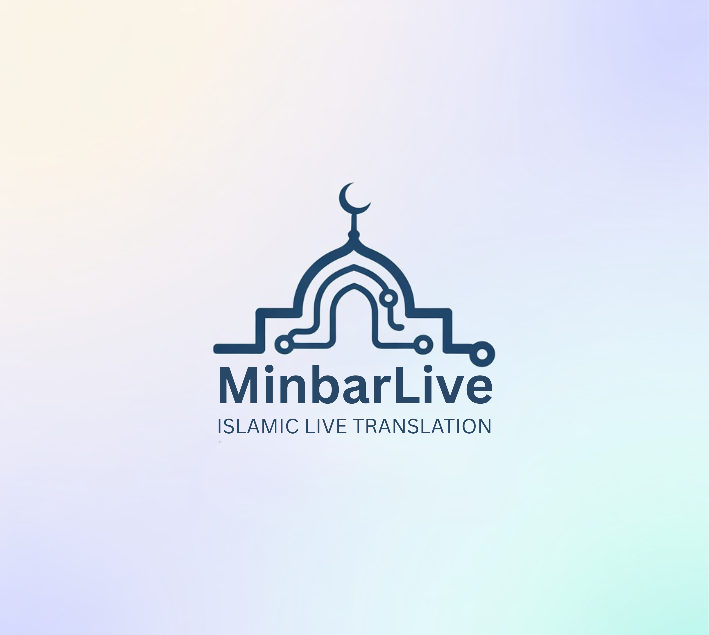

<div align="center">
    <a href="https://minbarlive.info/">
        
    </a>
</div>

# MinbarLive - Islamic Live Translation

Real-time translation system for mosque lectures and prayers, supporting multiple languages.

<br>

## Overview

This application captures live audio (from a microphone or directly from what your PC is playing), transcribes and translates the speech using AI models, and displays the translation as subtitles on a full-screen window (ideal for a second monitor, a projector, or an OBS overlay).

By default it runs in **real-time streaming mode**: the spoken text appears word by word while the speaker talks, and the translation follows each finished utterance after ~1–3 seconds. You can choose your AI provider: **OpenAI** (default), **Google Gemini**, or **Anthropic Claude**. A first-run setup wizard walks you through language, microphone, provider, and API key.

> **⚠️ Language Note:** The primary development and testing focus was **Arabic → German**. While the app supports 15+ source languages and 35+ target languages, other language combinations have not been extensively tested. The Quran and Athan dictionaries are available in **German, English, Turkish, Albanian, and Bosnian**. Contributions for additional language support are welcome!

### Key Features

- **Real-time streaming** (default): word-by-word transcript, translation per finished utterance — chunk-based and semantic modes as alternatives ([details](#real-time-vs-segmented-mode))
- **Your choice of AI provider**: OpenAI, Google Gemini, or Anthropic Claude, switchable in the settings
- **Verified Quran verses**: high-confidence matches show the exact published translation (marked 📖) instead of an AI paraphrase; Athan phrases via dictionary
- **System audio capture** (Windows): translate what the PC is playing, no virtual audio cable needed ([details](#audio-sources))
- **Noise filter**: a voice-activity gate drops static, hum and hiss before the AI can turn them into invented sentences
- **Subtitles your way**: three modes (realtime feed, ticker, static), optional original text above the translation, adjustable font, height and colours, multi-monitor and transparent overlay
- **Announcements**: put a message like "Prayer starts in 5 minutes" on the subtitle screen for a chosen duration ([details](#announcements))
- **Batch mode**: turn a recording into an `.srt` subtitle file or a plain transcript ([details](#batch-mode-subtitle-files-from-recordings))
- **History, AI summaries & cost estimates** per session ([details](#history-session-summaries--costs))
- **Islamic mode toggle**: switch off the Quran/Athan features to use MinbarLive as a general live translator
- **Built to survive a live session**: input level meter with mic test, silence detection, retries with model fallback, auto-stop after 10 minutes without speech, API keys in the OS keychain
- First-run setup wizard; control panel in 6 languages (DE, EN, AR, BS, SQ, TR); light & dark theme

📚 **More details:** See the [docs/](docs/) folder for architecture, providers, configuration, and data file documentation.

<br>

## ⚠️ API Cost Warning

This application makes continuous API calls while running. **You will be charged for usage by your AI provider.**

Rough guide for an OpenAI setup (the default; segmented mode, Arabic → German). Gemini is in a similar or lower range:

| Usage Pattern                   | Transcription | Translation | Embeddings | **Total**        |
| ------------------------------- | ------------- | ----------- | ---------- | ---------------- |
| 1 hour session                  | ~$0.36        | ~$0.10      | ~$0.05     | **~$0.50**       |
| Weekly Friday prayer (1 hr × 4) | ~$1.44        | ~$0.40      | ~$0.20     | **~$2.00/month** |

- **Real-time streaming mode** (the default) bills every audio minute **including silence**, and translates per utterance (more, smaller translation calls). Expect a somewhat higher total than segmented mode for the same session.
- Costs differ per provider and model. Check [Google Gemini](https://ai.google.dev/pricing), [OpenAI](https://openai.com/pricing), [Anthropic](https://www.anthropic.com/pricing), or [Deepgram](https://deepgram.com/pricing) pricing for current rates, and set a usage limit in your provider account to avoid surprises.
- The app tracks what each of **your** sessions actually used: see the **Costs** tab in the session history (⟲). It is an estimate from published list prices, not a bill.

<br>

## Setup

🎬 **Watch first, two short videos:**

- **What MinbarLive is and how it works** — [English](https://www.youtube.com/watch?v=ajzSpuskEro) · [Deutsch](https://www.youtube.com/watch?v=GWvEXOW8930)
- **How to install it** — [Setup tutorial](https://youtu.be/TvxxN0iadck)

> 📧 **Need help setting up?** Write us an email at [minbar.live@outlook.com](mailto:minbar.live@outlook.com) and we'll help you with your first setup.

### Prerequisites

- An API key for your AI provider. An **OpenAI key is the simplest option** and what the app defaults to: one key covers translation, real-time transcription, and Quran verse matching. (Gemini/Claude/Deepgram keys are only needed if you choose those providers; Claude has no speech-to-text, so it additionally needs a transcription key.)
- An audio source: a microphone, or (on Windows) any output device captured via loopback (see [Audio Sources](#audio-sources))
- Python 3.11 or newer (Option B only). 3.12 is what CI and the prebuilt apps use; 3.10 will not install, because `numpy` and `scipy` require 3.11+

### Option A: Download a prebuilt app (recommended)

1. Download for your platform from the [latest release](https://github.com/MinbarLive/MinbarLive/releases/latest):
   - **Windows:** [`MinbarLive.exe`](https://github.com/MinbarLive/MinbarLive/releases/latest/download/MinbarLive.exe) — just run it.
   - **macOS (Apple Silicon only — M1 and newer):** [`MinbarLive-macos-arm64.zip`](https://github.com/MinbarLive/MinbarLive/releases/latest/download/MinbarLive-macos-arm64.zip) — unzip, move `MinbarLive.app` to Applications, then see the macOS note below for the first launch.
   - **Linux:** [`MinbarLive-x86_64.AppImage`](https://github.com/MinbarLive/MinbarLive/releases/latest/download/MinbarLive-x86_64.AppImage) — `chmod +x` it, then double-click. No FUSE required.
2. Follow the first-run wizard
3. It's Running!

> **Windows SmartScreen:** You may see a warning because the EXE is not code-signed. Click "More info" → "Run anyway".

> **macOS:** The `.app` is **experimental** and ships **unsigned**. It is **Apple Silicon only (M1 and newer) — it will not run on Intel Macs**. Because it is not signed or notarized, Gatekeeper blocks the first launch: **right-click the app → "Open" → "Open"**. If macOS refuses outright, open **System Settings → Privacy & Security** and click **"Open Anyway"** next to the MinbarLive message, then launch it again. This is the same "unknown developer" warning Windows shows for the EXE. Grant the microphone permission when asked, or there is no audio. Two platform limits: system-audio **loopback capture does not exist on macOS** (route audio through a virtual device such as [BlackHole](https://existential.audio/blackhole/), which then shows up as a normal input), and the subtitle overlay **cannot float above the Dock or the menu bar**, so it is laid out inside the usable screen area instead of covering them.

> **Linux:** The AppImage runs on modern desktops without extra dependencies, but is still maturing. The borderless overlay and transparent static mode work here too, but a few things remain Windows-only: system-audio **loopback capture** does not exist, so Linux has microphone input only, and **overlay placement and always-on-top** need X11 — under Wayland the compositor centres the overlay and the always-on-top setting does nothing. Per-pixel transparency also wants a compositing window manager. API-key storage needs a Secret Service keychain (GNOME Keyring / KWallet) — without one, keys are never written to disk and apply to the running session only. See [docs/ci.md](docs/ci.md).

### Option B: Build it yourself (Python)

```bash
git clone https://github.com/MinbarLive/MinbarLive.git
cd MinbarLive
python -m venv .venv
.\.venv\Scripts\activate      # Windows
# source .venv/bin/activate   # Linux/Mac
pip install -r requirements.txt
python main.py
```

> **Linux — system packages (running from source only).** A few native
> libraries are provided by the OS, not by pip, so `requirements.txt` cannot
> install them. On Debian/Ubuntu:
>
> ```bash
> sudo apt install libportaudio2 \
>   libxcb-cursor0 libxcb-icccm4 libxcb-image0 libxcb-keysyms1 libxcb-randr0 \
>   libxcb-render-util0 libxcb-shape0 libxcb-xinerama0 libxcb-xkb1 libxkbcommon-x11-0
> ```
>
> - The `libxcb-*` set — Qt's X11 platform plugin links against them and will not
>   load without them. The app then falls back to Wayland, where a client cannot
>   place its own windows or keep them on top, so the subtitle overlay sits in
>   the middle of the screen and ignores always-on-top. (The AppImage bundles
>   them; this is only for running from source.)
> - `libportaudio2` — PortAudio, for microphone capture. Without it the app
>   exits at startup with `OSError: PortAudio library not found`. (The
>   prebuilt AppImage bundles PortAudio, so this only affects source runs.)
> - **System-audio (loopback) capture** additionally needs a running
>   PulseAudio/PipeWire server that exposes a `…​.monitor` source
>   (`sudo apt install pipewire-pulse pulseaudio-utils`, then check with
>   `pactl list sources short | grep -i monitor`). A bare-ALSA box has no
>   monitor source, so no loopback device appears.

Enter your API key in the first-run wizard (stored securely in the OS keychain), or provide it via a `.env` file / environment variable (`OPENAI_API_KEY`, `GEMINI_API_KEY`, `ANTHROPIC_API_KEY`, `DEEPGRAM_API_KEY`).

Two windows will appear:

- **Control Panel** - Start/Stop, settings, batch mode, history, API key management
- **Subtitles** - Full-screen translated text display

Only one copy runs at a time: starting a second one brings up a notice instead, with a **"Launch Anyway"** option if you really do want two instances (they will compete for the same microphone and settings file).

Closing the subtitle window (Alt+F4, or Close on its taskbar entry) stops a running session and closes only that window — Start recreates it. The subtitle window never takes keyboard focus and is transparent to the mouse, so clicks and shortcuts go to whatever is behind it; Stop and Quit are the control panel's job.

<br>

## Real-time vs. Segmented Mode

The **Processing Strategy** dropdown in the control panel selects the pipeline:

| Strategy                          | How it works                                                                      | Speech → subtitle delay |
| --------------------------------- | --------------------------------------------------------------------------------- | ----------------------- |
| **Real-time streaming** (default) | Live transcript appears word by word; translation follows each finished utterance | ~1–3 s                  |
| **Chunk-based**                   | Fixed 12 s audio segments, each translated immediately                            | ~4–14 s                 |
| **Semantic buffering** (Beta)     | Buffers segments until a complete sentence is detected                            | ~5–15 s                 |

Real-time mode supports three transcription engines: **OpenAI Realtime** (default, uses your existing OpenAI key), **Google Gemini Live**, and **Deepgram Nova**. Segmented mode transcribes via OpenAI or Gemini. See [docs/providers.md](docs/providers.md).

> **Note on engine choice:** OpenAI Realtime is the default because it is the only engine measured to transcribe as fast as you speak. The Gemini Live engines run below realtime (~0.75× on a 63-second sample), so on continuous speech the subtitles fall progressively further behind and do not catch up until the speaker pauses.

<br>

## Audio Sources

The **input device** dropdown lists two kinds of source:

| Source                   | What it captures                              | Typical use                                             |
| ------------------------ | --------------------------------------------- | ------------------------------------------------------- |
| A microphone             | What the mic hears                            | The khateeb's mic, a mixer output, an audio interface   |
| `… (Loopback)` (Windows) | Whatever is **playing** on that output device | A live stream, a video call, a recording on the same PC |

Loopback entries are the PC's speakers/headphones captured via WASAPI, so you can translate audio that is only playing on the computer **without a virtual audio cable** (VB-CABLE and similar are no longer needed). They appear automatically, marked `(Loopback)`, and are selected exactly like a microphone.

> **macOS has no loopback.** CoreAudio offers no way to record an output device, so no `(Loopback)` entries are listed there. To translate audio playing on the Mac, install a virtual audio device ([BlackHole](https://existential.audio/blackhole/) or Loopback) and select it as an ordinary input.

> **Mic quality matters more than any setting.** The AI engines need a healthy signal level: a very quiet input (a mic with the gain turned down) produces sporadic or missing transcripts, and no software setting can recover it. If recognition is poor, raise the input gain at the source (interface knob, Windows mic level) first. Loopback sources are digital and always at full level.

Use the **Test mic** button next to the level bar to check this before a session: speak normally and aim for the bar to sit in the green-to-amber range. If it barely moves, turn the gain up at the source rather than changing settings in the app. The meter also runs during a live session.

<br>

## Batch Mode: Subtitle Files from Recordings

The **Batch / File** card in the control panel processes a pre-recorded audio or video file through the same transcription → Quran matching → translation pipeline and writes an `.srt` subtitle file next to the source file (e.g. `lecture.de.srt`).

- Any common audio/video format. Non-WAV files are converted via **ffmpeg**. If it is missing, Windows offers a one-time automatic download; macOS and Linux get the install command to run (`brew install ffmpeg`, `sudo apt install ffmpeg`, …)
- Transcription/translation model selectable per run
- Finished runs are stored in the session history (Batch tab)

<br>

## Announcements

The ⚑ button opens a small window to type a message ("Prayer starts in 5 minutes", "Please switch phones to silent") and choose how long it stays up: 10 s, 30 s, 1 min, 5 min, or until you stop it. It appears large and centred on the subtitle screen, above the subtitles. Frequently used messages can be pinned as favourites, and the last few are kept for one-click re-use. An "until stopped" announcement stays up even when translation is stopped, unless you turn that off in the announcement window.

<br>

## History, Session Summaries & Costs

The ⟲ button in the control panel opens the session history: browse past live sessions, batch runs, and log files, export transcripts, and generate an **AI summary** of a session in a language of your choice (summaries are saved alongside the history).

Its **Costs** tab shows what each session used and what it approximately cost. This is an estimate computed from the usage each provider reports and a stored snapshot of public list prices. Always check your provider's dashboard for the authoritative figure. Anthropic and Deepgram usage is not metered yet. Only counters, model names and timestamps are stored; no transcripts, audio or keys.

<br>

## Mirroring/Streaming/Record with OBS

Easiest way to mirror, stream or record with camera + subtitles using [OBS Studio](https://obsproject.com/):

1. **Add your camera**: Sources → Add → Video Capture Device
2. **Add the subtitle window**: Sources → Add → Window Capture → Select `[MinbarLive.exe]: MinbarLive Subtitles`
3. **Set the capture method** (Windows): in the same properties window, set **Capture Method** to `Windows 10 (1903 and up)`
4. **Position subtitles at bottom**: Right-click the subtitle source → Transform → Edit Transform → Set "Positional Alignment" to **Bottom Center**
5. **Display on another monitor**: Right-click the canvas → Open Preview Projector → Select your monitor (press `Escape` to exit)
6. **Auto-restore projector on startup**: Go to File → Settings → General → Projectors → Enable "Save projectors on exit" to automatically reopen the projector window when OBS starts

This overlays the live translations on your camera feed for Mirroring, YouTube, Zoom, or recording.

> **If the subtitle source shows a black rectangle**, the Capture Method is set to
> `Automatic` or `BitBlt (Windows 7 and up)`. The overlay draws with per-pixel
> transparency, and neither of those methods can read such a window — they return an
> empty, fully black frame. `Windows 10 (1903 and up)` reads it correctly. It has to be
> chosen by hand: OBS's `Automatic` falls back to BitBlt for everything except a short
> built-in list of window types, which no Qt window belongs to. A **Display Capture** of
> the subtitle monitor is the other option that works. This applies to Windows only — on
> Linux and macOS, OBS captures the overlay window as it is.

<br>

## Runtime Files

Runtime files are written to a per-user app data folder:

- **Windows**: `%APPDATA%\MinbarLive\`
- **macOS**: `~/Library/Application Support/MinbarLive/`
- **Linux**: `~/.local/share/MinbarLive/`

API keys live in the **OS keychain** and are **never written to `settings.json`**. On a machine with no keychain backend at all (typically Linux without GNOME Keyring/KWallet) nothing is persisted: the key applies to that session only and must be entered again after a restart — the app tells you when this happens. Set up a keychain, or use an environment variable or `.env`, to avoid re-entering it. See [docs/providers.md](docs/providers.md#api-keys).

**Updating:** replace the program file (`.exe` / `.app` / `.AppImage`). Everything above is kept and you carry straight on.

**Removing everything:** ⚙ Settings → **Delete everything** deletes that whole folder *and* the keychain entries for every provider, tells you what went, and closes the app; the next start begins at the setup wizard. Deleting the folder by hand leaves the keychain entries behind, which is why the button exists.

<br>

## Update Check

At startup the app makes one anonymous request to the GitHub releases API to
see if a newer version exists. If so, a notice appears in the control panel and
opens the release page when clicked. No data about you or your installation is
sent (GitHub sees only the request itself), and you can turn the check off in
⚙ Settings.

Two ways to put the notice away, and they differ: **✕** hides it until the next
launch, while **Skip this version** silences it for that release for good — the
next release brings it back. So staying on your current build does not mean
turning the whole check off.

By default only finished releases count. **Also offer beta and test versions** in
⚙ Settings widens the check to release candidates, for testers who want them; the
download buttons on the website always point at the stable release.

<br>

## Documentation

| Document                                               | Description                                            |
| ------------------------------------------------------ | ------------------------------------------------------ |
| [docs/architecture.md](docs/architecture.md)           | System architecture, pipelines, and data flow          |
| [docs/providers.md](docs/providers.md)                 | AI providers, transcription engines, models, API keys  |
| [docs/project-structure.md](docs/project-structure.md) | Full project tree and file descriptions                |
| [docs/configuration.md](docs/configuration.md)         | All configurable settings and constants                |
| [docs/data-files.md](docs/data-files.md)               | Quran/Athan translations, embeddings, adding languages |
| [docs/testing.md](docs/testing.md)                     | Running tests and coverage                             |
| [docs/ci.md](docs/ci.md)                               | GitHub Actions workflow, LFS policy, required checks   |

<br>

## Feedback

- **GitHub Issues**: [Open an issue](https://github.com/MinbarLive/MinbarLive/issues)
- **Google Forms**: [Submit feedback](https://forms.gle/DJ3F25HKrrLjH9h59) anonymously
- **Email**: [minbar.live@outlook.com](mailto:minbar.live@outlook.com)

<br>

## Contributing

Contributions are welcome! Please see [CONTRIBUTING.md](CONTRIBUTING.md) for guidelines.

<br>

## Acknowledgments

MinbarLive would not exist without the help of:

- **[marxmoo](https://github.com/marxmoo)**: backend
- **[Merisgrund](https://github.com/Merisgrund)**: frontend
- Others who wish to remain anonymous

Barakallahu feekum 🌙

<br>

## License

AGPL-3.0. See `LICENSE`.
